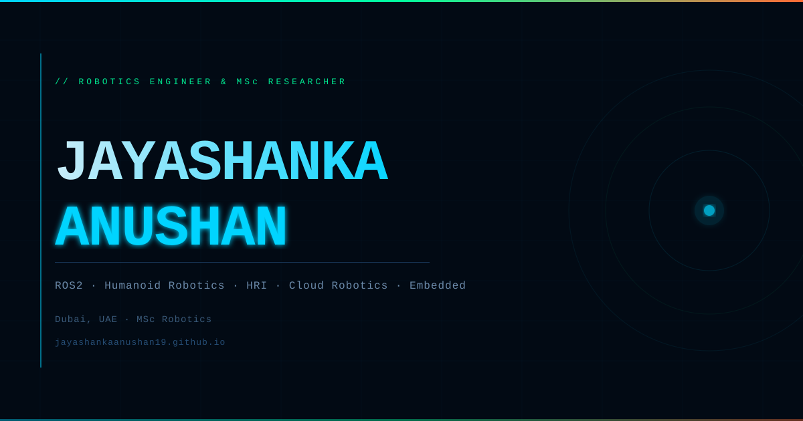
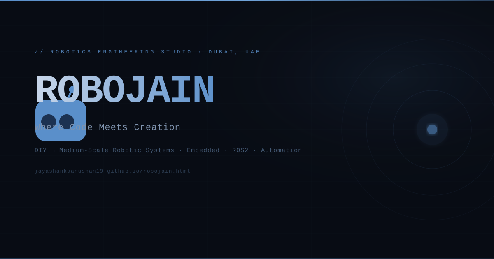

<div align="center">

<!-- Live site preview — click to open -->
<a href="https://jayashankaanushan19.github.io" title="Open live site">
  
</a>

<br/><br/>

### [🔗 jayashankaanushan19.github.io — Click to open](https://jayashankaanushan19.github.io)

<br/>

[](https://jayashankaanushan19.github.io)
[](#)
[](#)
[](#)

</div>

---

## Overview

Personal portfolio website for **Jayashanka Anushan** — Robotics Engineer and MSc Researcher based in Dubai, UAE. Built with zero dependencies: pure HTML5, CSS3, and vanilla JavaScript. Deployed automatically to GitHub Pages on every push to `main`.

---

## Pages

| Page | URL | Description |
|------|-----|-------------|
| Portfolio | [jayashankaanushan19.github.io](https://jayashankaanushan19.github.io) | Main portfolio — about, skills, live GitHub repos, YouTube, research |
| RoboJain | [/robojain.html](https://jayashankaanushan19.github.io/robojain.html) | RoboJain robotics company page |
| Posts Feed | [/robojain-posts.html](https://jayashankaanushan19.github.io/robojain-posts.html) | Aggregated social posts — LinkedIn, Instagram, TikTok |

---

## Features

**Portfolio (`index.html`)**
- Animated SVG humanoid robot in the hero section
- Live GitHub repository feed — pulls from the GitHub API on every page load
- YouTube video section — loads latest videos via RSS proxy
- Animated stat counters, scroll reveal, smooth scroll
- JAY-AI voice assistant — ask anything about Jayashanka via text or microphone
- Mobile-responsive with hamburger navigation
- Scroll progress bar, back-to-top button

**SEO**
- JSON-LD `Person` structured data for Google Knowledge Graph
- Full Open Graph + Twitter Card meta for social sharing
- `robots.txt` and `sitemap.xml` registered at `/sitemap.xml`
- Canonical URL, `theme-color`, geo meta tags

**RoboJain Pages**
- Company overview, capabilities, build log, and process flow
- Official LinkedIn, Instagram, and TikTok embeds in the posts feed
- Add a new post by pasting one URL into the `POSTS` array in `robojain-posts.html`

---

## Adding Social Posts (RoboJain)

Open `robojain-posts.html` and find the `POSTS` array. One line per post:

```js
{ platform:'instagram', url:'https://www.instagram.com/p/SHORTCODE/', date:'YYYY-MM' },
{ platform:'tiktok',    url:'https://www.tiktok.com/@handle/video/VIDEO_ID', videoId:'VIDEO_ID', date:'YYYY-MM' },
{ platform:'linkedin',  url:'https://www.linkedin.com/posts/...-activity-XXXXXXXX-XXXX', date:'YYYY-MM' },
```

Instagram and TikTok content loads automatically from the platforms — no copy-pasting needed. LinkedIn posts embed via the official LinkedIn iframe.

---

## Tech Stack

| Layer | Technologies |
|-------|-------------|
| Languages | HTML5, CSS3, Vanilla JavaScript |
| Fonts | Orbitron, Space Mono, DM Sans (Google Fonts) |
| APIs | GitHub REST API, YouTube RSS, Platform Embeds |
| Hosting | GitHub Pages (auto-deploy on push to `main`) |

---

## RoboJain

<a href="https://jayashankaanushan19.github.io/robojain.html" title="RoboJain company page">
  
</a>

**[→ robojain.html](https://jayashankaanushan19.github.io/robojain.html)** — Robotics engineering studio in Dubai, UAE. DIY-to-medium-scale robotic systems, embedded engineering, and automation.

---

<div align="center">

*Hosted on GitHub Pages · © 2026 Jayashanka Anushan*

</div>
